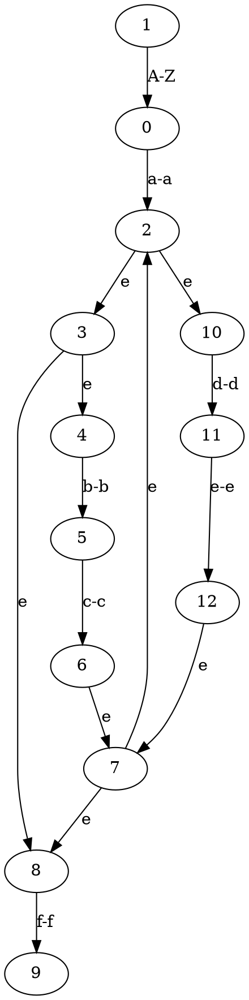

## TOC

* [Overview](#overview)
* [Build](#build)
* [Example](#example)
* [Automata](#automata)

## Overview

clex is a tiny, battle-tested lexer generator for C. Feed it a list of regular
expressions and it will hand back tokens one by one from an input string.

Some highlights:

* Simple C API, no code generation phase.
* Regex syntax supports grouping, alternation, character classes, ranges, and
  the usual `* + ?` operators.
* Whitespace between tokens is skipped automatically.
* Safe failure modes – invalid rules return `false`, and the lexer yields
  `{.kind = -1, .lexeme = NULL}` on EOF or when no rule matches.

The maximum number of rules is 1024 by default (see `CLEX_MAX_RULES` in
`clex.h`).

### Core API

```c
clexLexer *clexInit(void);
void       clexReset(clexLexer *lexer, const char *content);
bool       clexRegisterKind(clexLexer *lexer, const char *regex, int kind);
clexToken  clex(clexLexer *lexer);
void       clexDeleteKinds(clexLexer *lexer);
void       clexLexerDestroy(clexLexer *lexer);
```

Common flow:

1. `clexInit()` to allocate a lexer.
2. Call `clexRegisterKind()` for each token. It returns `false` when passed a
   `NULL` lexer/regex, when the regex fails to compile, or when the rule table is
   full – check this to catch setup issues early.
3. `clexReset()` with the source buffer (you own the lifetime of the string).
4. Repeatedly call `clex()` until it returns the EOF sentinel above. Each token
   owns its `lexeme` buffer; free it when no longer needed.
5. Tear down with `clexDeleteKinds()` for reuse, or `clexLexerDestroy()` to free
   everything.

## Build

### Using Makefile (Recommended)

A Makefile is provided for easy building and testing:

```bash
# Show available commands
make help

# Run all tests
make test-all

# Run specific tests
make test-clex   # Test lexer functionality
make test-regex  # Test regex patterns
make test-nfa    # Generate NFA graphs

# Quick test check
make check

# Build the example from this README
make example

# Build object files for library use
make lib

# Clean build artifacts
make clean
```

### Manual compilation

Simply pass `fa.c`, `fa.h`, `clex.c`, and `clex.h` to your compiler along with your own application that has a `main` function:

```bash
gcc your_app.c fa.c clex.c -o your_app
```

### Manual test compilation

```bash
gcc tests.c fa.c clex.c -D TEST_CLEX && ./a.out
gcc tests.c fa.c clex.c -D TEST_REGEX && ./a.out
gcc tests.c fa.c clex.c -D TEST_NFA_DRAW && ./a.out
```

No output means all tests passed!

You can also run the suites individually with the provided Make targets:

```bash
make test-clex   # Lexer API & integration tests
make test-regex  # Regex construction & matching tests
```

## Example

```c
#include "clex.h"
#include <assert.h>
#include <string.h>

typedef enum TokenKind {
  INT,
  OPARAN,
  CPARAN,
  OSQUAREBRACE,
  CSQUAREBRACE,
  OCURLYBRACE,
  CCURLYBRACE,
  COMMA,
  CHAR,
  STAR,
  RETURN,
  SEMICOL,
  CONSTANT,
  IDENTIFIER,
} TokenKind;

int main() {
  clexLexer *lexer = clexInit();

  clexRegisterKind(lexer, "int", INT);
  clexRegisterKind(lexer, "\\(", OPARAN);
  clexRegisterKind(lexer, "\\)", CPARAN);
  clexRegisterKind(lexer, "\\[|<:", OSQUAREBRACE);
  clexRegisterKind(lexer, "\\]|:>", CSQUAREBRACE);
  clexRegisterKind(lexer, "{|<%", OCURLYBRACE);
  clexRegisterKind(lexer, "}|%>", CCURLYBRACE);
  clexRegisterKind(lexer, ",", COMMA);
  clexRegisterKind(lexer, "char", CHAR);
  clexRegisterKind(lexer, "\\*", STAR);
  clexRegisterKind(lexer, "return", RETURN);
  clexRegisterKind(lexer, "[1-9][0-9]*([uU])?([lL])?([lL])?", CONSTANT);
  clexRegisterKind(lexer, ";", SEMICOL);
  clexRegisterKind(lexer, "[a-zA-Z_]([a-zA-Z_]|[0-9])*", IDENTIFIER);

  clexReset(lexer, "int main(int argc, char *argv[]) {\nreturn 23;\n}");

  clexToken token = clex(lexer);
  assert(token.kind == INT);
  assert(strcmp(token.lexeme, "int") == 0);

  token = clex(lexer);
  assert(token.kind == IDENTIFIER);
  assert(strcmp(token.lexeme, "main") == 0);

  token = clex(lexer);
  assert(token.kind == OPARAN);
  assert(strcmp(token.lexeme, "(") == 0);

  token = clex(lexer);
  assert(token.kind == INT);
  assert(strcmp(token.lexeme, "int") == 0);

  token = clex(lexer);
  assert(token.kind == IDENTIFIER);
  assert(strcmp(token.lexeme, "argc") == 0);

  token = clex(lexer);
  assert(token.kind == COMMA);
  assert(strcmp(token.lexeme, ",") == 0);

  token = clex(lexer);
  assert(token.kind == CHAR);
  assert(strcmp(token.lexeme, "char") == 0);

  token = clex(lexer);
  assert(token.kind == STAR);
  assert(strcmp(token.lexeme, "*") == 0);

  token = clex(lexer);
  assert(token.kind == IDENTIFIER);
  assert(strcmp(token.lexeme, "argv") == 0);

  token = clex(lexer);
  assert(token.kind == OSQUAREBRACE);
  assert(strcmp(token.lexeme, "[") == 0);

  token = clex(lexer);
  assert(token.kind == CSQUAREBRACE);
  assert(strcmp(token.lexeme, "]") == 0);

  token = clex(lexer);
  assert(token.kind == CPARAN);
  assert(strcmp(token.lexeme, ")") == 0);

  token = clex(lexer);
  assert(token.kind == OCURLYBRACE);
  assert(strcmp(token.lexeme, "{") == 0);

  token = clex(lexer);
  assert(token.kind == RETURN);
  assert(strcmp(token.lexeme, "return") == 0);

  token = clex(lexer);
  assert(token.kind == CONSTANT);
  assert(strcmp(token.lexeme, "23") == 0);

  token = clex(lexer);
  assert(token.kind == SEMICOL);
  assert(strcmp(token.lexeme, ";") == 0);

  token = clex(lexer);
  assert(token.kind == CCURLYBRACE);
  assert(strcmp(token.lexeme, "}") == 0);

  token = clex(lexer);
  assert(token.kind == -1);
  assert(token.lexeme == NULL);
}
```

# Automata

NFA can be drawn with Graphviz.

```c
#include "fa.h"

int main(int argc, char *argv) {
  Node *nfa = clexNfaFromRe("[A-Z]a(bc|de)*f");
  clexNfaDraw(nfa);
}
```

Above code will output this to stdout:



The output can be processed with Graphviz to get the graph image:

```bash
dot -Tpng output.dot > output.png
```
