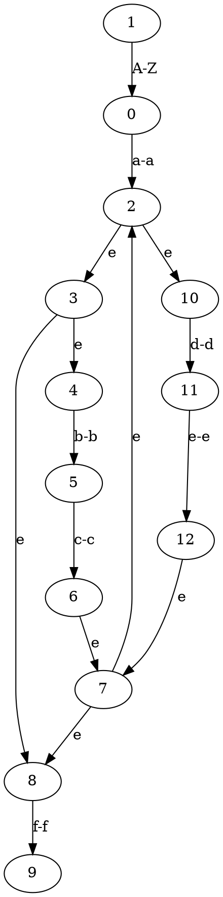

## TOC

* [Overview](#overview)
* [Build](#build)
* [Example](#example)
* [Automata](#automata)

## Overview

clex is a tiny, battle-tested lexer generator for C. Feed it a list of regular
expressions and it will hand back tokens one by one from an input string.

Some highlights:

* Simple C API, no code generation phase.
* Regex syntax supports grouping, alternation, character classes, ranges, and
  the usual `* + ?` operators.
* Whitespace between tokens is skipped automatically.
* Typed status codes (`clexStatus`) instead of bool/sentinel error signaling.
* Structured lexer errors with exact source position, offending lexeme, and
  expected token kinds (`clexError`).
* Every token includes a source span with byte offset + line/column.

The maximum number of rules is 1024 by default (see `CLEX_MAX_RULES` in
`clex.h`).

### Core API

```c
typedef enum clexStatus {
  CLEX_STATUS_OK,
  CLEX_STATUS_EOF,
  CLEX_STATUS_INVALID_ARGUMENT,
  CLEX_STATUS_OUT_OF_MEMORY,
  CLEX_STATUS_REGEX_ERROR,
  CLEX_STATUS_RULE_LIMIT_REACHED,
  CLEX_STATUS_NO_RULES,
  CLEX_STATUS_LEXICAL_ERROR
} clexStatus;

clexLexer *clexInit(void);
void       clexReset(clexLexer *lexer, const char *content);
clexStatus clexRegisterKind(clexLexer *lexer, const char *regex, int kind);
clexStatus clex(clexLexer *lexer, clexToken *out_token);
const clexError *clexGetLastError(const clexLexer *lexer);
void       clexTokenInit(clexToken *token);
void       clexTokenClear(clexToken *token);
void       clexDeleteKinds(clexLexer *lexer);
void       clexLexerDestroy(clexLexer *lexer);
```

Common flow:

1. `clexInit()` to allocate a lexer.
2. Call `clexRegisterKind()` for each token and check for `CLEX_STATUS_OK`.
3. `clexReset()` with the source buffer (you own the lifetime of the string).
4. Repeatedly call `clex()`. It returns `CLEX_STATUS_OK` for a token,
   `CLEX_STATUS_EOF` at end-of-input, or an error status.
   When lexical analysis fails, inspect `clexGetLastError()` for position,
   offending lexeme, and expected token kinds.
   Each token owns its `lexeme` buffer; release it with `clexTokenClear()`.
5. Tear down with `clexDeleteKinds()` for reuse, or `clexLexerDestroy()` to free
   everything.

## Build

### Using Makefile (Recommended)

A Makefile is provided for easy building and testing:

```bash
# Show available commands
make help

# Run all tests
make test-all

# Run specific tests
make test-clex   # Test lexer functionality
make test-regex  # Test regex patterns
make test-nfa    # Generate NFA graphs

# Quick test check
make check

# Build the example from this README
make example

# Build object files for library use
make lib

# Clean build artifacts
make clean
```

### Manual compilation

Simply pass `fa.c`, `fa.h`, `clex.c`, and `clex.h` to your compiler along with your own application that has a `main` function:

```bash
gcc your_app.c fa.c clex.c -o your_app
```

### Manual test compilation

```bash
gcc tests.c fa.c clex.c -D TEST_CLEX && ./a.out
gcc tests.c fa.c clex.c -D TEST_REGEX && ./a.out
gcc tests.c fa.c clex.c -D TEST_NFA_DRAW && ./a.out
```

No output means all tests passed!

You can also run the suites individually with the provided Make targets:

```bash
make test-clex   # Lexer API & integration tests
make test-regex  # Regex construction & matching tests
```

## Example

```c
#include "clex.h"
#include <assert.h>
#include <stdio.h>
#include <string.h>

typedef enum TokenKind {
  TOK_INT,
  TOK_IDENT,
  TOK_SEMICOL
} TokenKind;

int main() {
  clexLexer *lexer = clexInit();
  assert(lexer != NULL);

  assert(clexRegisterKind(lexer, "int", TOK_INT) == CLEX_STATUS_OK);
  assert(clexRegisterKind(lexer, "[a-zA-Z_]([a-zA-Z_]|[0-9])*", TOK_IDENT) ==
         CLEX_STATUS_OK);
  assert(clexRegisterKind(lexer, ";", TOK_SEMICOL) == CLEX_STATUS_OK);

  clexReset(lexer, "int answer;");

  clexToken token;
  clexTokenInit(&token);

  while (1) {
    clexStatus status = clex(lexer, &token);
    if (status == CLEX_STATUS_EOF) {
      break;
    }
    if (status != CLEX_STATUS_OK) {
      const clexError *error = clexGetLastError(lexer);
      fprintf(stderr, "lex error at %zu:%zu near '%s'\n", error->position.line,
              error->position.column,
              error->offending_lexeme ? error->offending_lexeme : "");
      break;
    }
    printf("kind=%d lexeme=%s @ %zu:%zu\n", token.kind, token.lexeme,
           token.span.start.line, token.span.start.column);
  }

  clexTokenClear(&token);
  clexLexerDestroy(lexer);
}
```

# Automata

NFA can be drawn with Graphviz.

```c
#include "fa.h"

int main(int argc, char *argv) {
  Node *nfa = clexNfaFromRe("[A-Z]a(bc|de)*f");
  clexNfaDraw(nfa);
}
```

Above code will output this to stdout:



The output can be processed with Graphviz to get the graph image:

```bash
dot -Tpng output.dot > output.png
```
